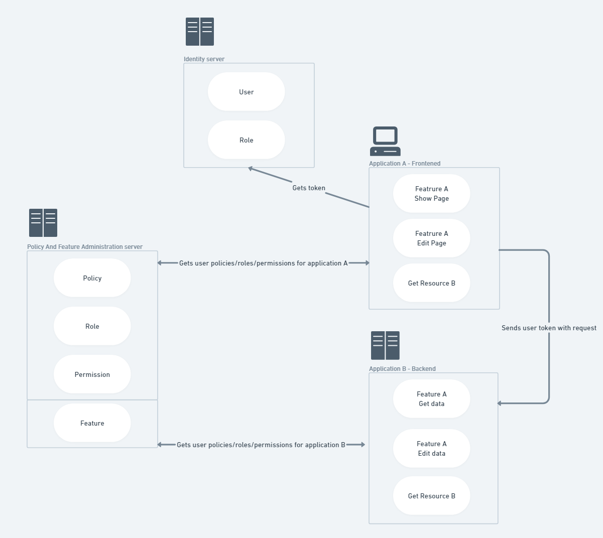

# MopPolicyServer

# **Project is currently under development** 

The Mop Policy Server is a authorization and access control system designed to manage policies, roles, permissions, and users for various applications. This server acts as a central authority, providing information about user access rights to other connected applications.

## Features

- **Authorization Policies:** Implement customizable authorization policies to determine access based on roles, criteria, or other conditions.
- **Role Management:** Users can create, modify, and delete roles, allowing for flexible access control.
- **Permissions:** Grant and manage permissions for roles or directly to users to specify actions they are allowed to perform.

## Future Features

- **Multi-tenancy** Project will have option for multi-tenant applications.
- (Multitenant application will be able to hold different policies/ UserA will be able have )
- **Caching and Refresh Mechanism:** The project will be extended to include middleware for caching user data in-memory and refreshing it when changes are made in the administrative panel.

